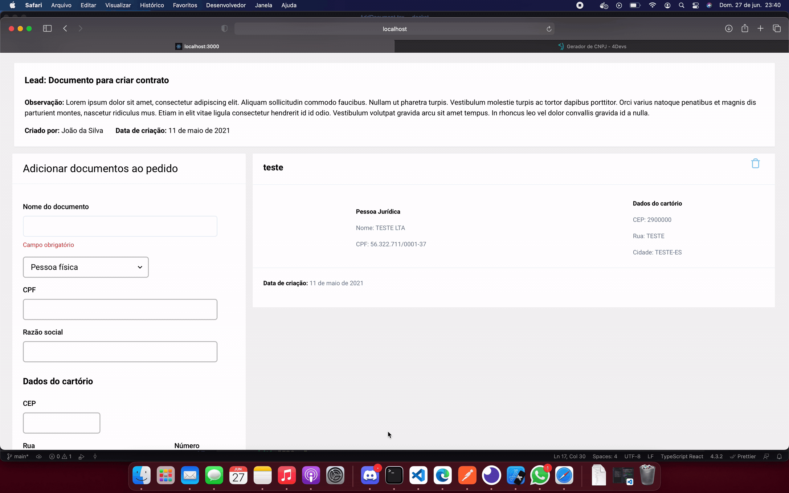

<h1 align="center">
  
</h1>

This project was build for DOCKET Challenge.

<blockquote align="center">“Não espere para plantar, apenas tenha paciência para colher”!(Rocketseat, 2020)</blockquote>

<h1 align="center">
  
</h1>

<h1 align="center">
  
</h1>

<h1 align="center">
  
</h1>

<h1 align="center">
  
</h1>

## Runing project

- 1: Run <strong> git clone in this repository </strong>

- 2: Run<strong> cd docket </strong>

- 3: Run<strong> yarn </strong> (install all dependencies);

- 4: Run<strong> yarn json-server --watch db.json </strong> (start server);

- 5: To finish, Run<strong> yarn dev </strong> (start server);

Open [http://localhost:3000](http://localhost:3000) with your browser to see the result.

## Deploy on Vercel or Netlify

The easiest way to deploy your Next.js app is to use the [Vercel Platform](https://vercel.com/new?utm_medium=default-template&filter=next.js&utm_source=create-next-app&utm_campaign=create-next-app-readme) from the creators of Next.js.

Check out our [Next.js deployment documentation](https://nextjs.org/docs/deployment) for more details.

Did you know you can deploy a Next.js site to Netlify, including support for dynamic routes, Preview Mode, and more? Learn how in this tutorial! [Netlify deploy nextjs tutorial](https://www.netlify.com/blog/2020/11/30/how-to-deploy-next.js-sites-to-netlify/)

---

For some questions, send me an email. =] (tiagohenriquequeiroz@gmail.com)